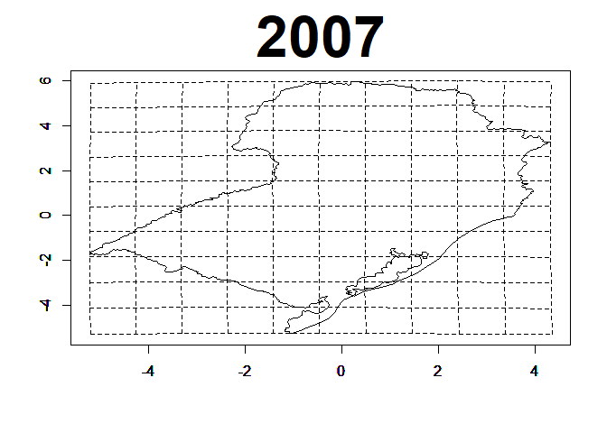

<!-- README.md is generated from README.Rmd. Please edit that file -->

# Stdyndef

<!-- badges: start -->
<!-- badges: end -->

# Stdyndef: Spatiotemporal Modeling with Dynamic Deformation for Nonstationary Covariance Structures

The `Stdyndef` package implements a novel spatiotemporal modeling
framework with dynamic deformation, allowing for nonstationary
covariance structures. This innovative approach is ideal for analyzing
spatiotemporal data with evolving spatial relationships, such as monthly
average temperature data.

## Installation

To install the development version of the `Stdyndef` package from
GitHub, you can use the `devtools` package:

``` r
# Install devtools if not already installed
install.packages("devtools")

# Install Stdyndef from GitHub
devtools::install_github("yourusername/Stdyndef")
```

### Features

- Dynamic spatiotemporal deformation for nonstationary covariance
  structures.
- Bayesian parameter estimation using MCMC methods.
- Tools for spatiotemporal interpolation and model comparison.

## Usage Examples

Below are some examples demonstrating the use of the key functions in
the package.

### Load the Package and Data

``` r
library(Stdyndef)
# Load sample data
data(temperature)
data(FT)
data(MatFFT)
data(GT)
data(sites)
data(GAMA)
data(Map)
```

### Fit the Spatiotemporal Model

The SpatialDeformationMCMC function fits the spatiotemporal model using
MCMC sampling.

``` r
# Fit the model
Mod <- SpatialDeformationMCMC(
  response = temperature,
  FT = FT,
  MatFFT = MatFFT,
  GT = GT,
  sites = sites,
  GAMA = GAMA,
  iteration = 10,
  burnin = 5,
  jump = 2
)
#> [1] 1
#> [1] 2
#> [1] 3
#> [1] 4
#> [1] 5
#> [1] 6
#> [1] 7
#> [1] 8
#> [1] 9
#> [1] 10
```

### Compute Dynamic Deformations

The compute_Mmd function estimates the dynamic deformations over a
specified grid resolution.

``` r
# Compute the posterior deformations on a 10x10 grid
DDj <- compute_Mmd(Mod, temperature, sites, Map, dd = 10)

# Select deformation for the first year in the series
j <- 1 # (j = 1, 2, ..., 15 for each posterior estimate over time)
year <- 2007:2021
xd <- DDj[1:(nrow(DDj) / 2), j]
yd <- DDj[(nrow(DDj) / 2 + 1):nrow(DDj), j]

# Combine x and y coordinates for grid and map deformations
xyd <- cbind(xd, yd)
xydgrad <- xyd[1:121, 1:2]
xydMap <- xyd[122:(121 + nrow(Map)), 1:2]

# Define grid lines
dd <- 10
lse1 <- seq(1, (dd + 1)^2, by = (dd + 1))
lse2 <- seq((dd + 1), (dd + 1)^2, by = (dd + 1))
minix <- min(xydgrad[, 1])
maxix <- max(xydgrad[, 1])
miniy <- min(xydgrad[, 2])
maxiy <- max(xydgrad[, 2])

# Overlay the grid lines on the deformation map
for (i in 1:(dd + 1)) {
  plot(xydgrad[(lse1[i]):(lse2[i]), 1:2], type = "l", lty = 2, xlab = " ", ylab = " ", xlim = c(minix, maxix), ylim = c(miniy, maxiy))
  par(new = T)
  plot(xydgrad[seq(i, (dd + 1)^2, by = (dd + 1)), 1:2], type = "l", lty = 2, xlab = " ", ylab = " ", xlim = c(minix, maxix), ylim = c(miniy, maxiy))
  par(new = T)
}

# Finalize the plot with map outline
plot(xydMap, type = "l", lty = 1, xlab = " ", ylab = " ", xlim = c(minix, maxix), ylim = c(miniy, maxiy), main = year[j], cex.main = 4)
```



### Calculate the Deviance Information Criterion (DIC)

The DIC function evaluates the model using the Deviance Information
Criterion.

``` r
# Calculate DIC
dic_results <- DIC(
  MCMC_output = Mod,
  response = temperature,
  FT = FT,
  MatFFT = MatFFT,
  GT = GT,
  sites = sites,
  GAMA = GAMA
)

 # View results
 dic_results$DIC          # Deviance Information Criterion
#> [1] 10280.12
 dic_results$Pd           # Effective number of parameters
#> NULL
 dic_results$mean_deviance # Posterior mean deviance
#> NULL
```

### Interpolate the Spatiotemporal Process

The *FTNO* matrix provides covariates for unobserved locations. Use
spatio_temporal_interpolation to estimate the process at these
locations.

``` r
library(graphics)
library(animation)
#> Warning: pacote 'animation' foi compilado no R versão 4.4.2
INDI <- c(4, 15, 16, 26:28, 36:39, 46:66, 69:77, 80:88, 92:99, 105:108, 119)

Fig <- (spatio_temporal_interpolation(Mod, temperature, FT, MatFFT, GT, sites, INDI, GAMA, FTNO, Map))


vecyest <- apply(Fig, 2, mean)
vecyp025 <- apply(Fig, 2, quantile, prob = c(0.025))
vecyp0975 <- apply(Fig, 2, quantile, prob = c(0.975))


yest <- t(matrix(vecyest, length(INDI), nrow(temperature)))
YEAR <- c(
  "2007/Jan./Summer", "2007/Feb./Summer", "2007/Mar./Summer", "2007/Apr./Autumn", "2007/May/Autumn", "2007/June/Autumn", "2007/July/Winter", "2007/Aug./Winter", "2007/Sept./Winter", "2007/Oct./Spring", "2007/Nov./Spring", "2007/Dec./Spring", "2008/Jan./Summer", "2008/Feb./Summer", "2008/Mar./Summer", "2008/Apr./Autumn", "2008/May/Autumn", "2008/June/Autumn", "2008/July/Winter", "2008/Aug./Winter", "2008/Sept./Winter", "2008/Oct./Spring", "2008/Nov./Spring", "2008/Dec./Spring",
  "2009/Jan./Summer", "2009/Feb./Summer", "2009/Mar./Summer", "2009/Apr./Autumn", "2009/May/Autumn", "2009/June/Autumn", "2009/July/Winter", "2009/Aug./Winter", "2009/Sept./Winter", "2009/Oct./Spring", "2009/Nov./Spring", "2009/Dec./Spring",
  "2010/Jan./Summer", "2010/Feb./Summer", "2010/Mar./Summer", "2010/Apr./Autumn", "2010/May/Autumn", "2010/June/Autumn", "2010/July/Winter", "2010/Aug./Winter", "2010/Sept./Winter", "2010/Oct./Spring", "2010/Nov./Spring", "2010/Dec./Spring",
  "2011/Jan./Summer", "2011/Feb./Summer", "2011/Mar./Summer", "2011/Apr./Autumn", "2011/May/Autumn", "2011/June/Autumn", "2011/July/Winter", "2011/Aug./Winter", "2011/Sept./Winter", "2011/Oct./Spring", "2011/Nov./Spring", "2011/Dec./Spring",
  "2012/Jan./Summer", "2012/Feb./Summer", "2012/Mar./Summer", "2012/Apr./Autumn", "2012/May/Autumn", "2012/June/Autumn", "2012/July/Winter", "2012/Aug./Winter", "2012/Sept./Winter", "2012/Oct./Spring", "2012/Nov./Spring", "2012/Dec./Spring",
  "2013/Jan./Summer", "2013/Feb./Summer", "2013/Mar./Summer", "2013/Apr./Autumn", "2013/May/Autumn", "2013/June/Autumn", "2013/July/Winter", "2013/Aug./Winter", "2013/Sept./Winter", "2013/Oct./Spring", "2013/Nov./Spring", "2013/Dec./Spring",
  "2014/Jan./Summer", "2014/Feb./Summer", "2014/Mar./Summer", "2014/Apr./Autumn", "2014/May/Autumn", "2014/June/Autumn", "2014/July/Winter", "2014/Aug./Winter", "2014/Sept./Winter", "2014/Oct./Spring", "2014/Nov./Spring", "2014/Dec./Spring",
  "2015/Jan./Summer", "2015/Feb./Summer", "2015/Mar./Summer", "2015/Apr./Autumn", "2015/May/Autumn", "2015/June/Autumn", "2015/July/Winter", "2015/Aug./Winter", "2015/Sept./Winter", "2015/Oct./Spring", "2015/Nov./Spring", "2015/Dec./Spring",
  "2016/Jan./Summer", "2016/Feb./Summer", "2016/Mar./Summer", "2016/Apr./Autumn", "2016/May/Autumn", "2016/June/Autumn", "2016/July/Winter", "2016/Aug./Winter", "2016/Sept./Winter", "2016/Oct./Spring", "2016/Nov./Spring", "2016/Dec./Spring",
  "2017/Jan./Summer", "2017/Feb./Summer", "2017/Mar./Summer", "2017/Apr./Autumn", "2017/May/Autumn", "2017/June/Autumn", "2017/July/Winter", "2017/Aug./Winter", "2017/Sept./Winter", "2017/Oct./Spring", "2017/Nov./Spring", "2017/Dec./Spring",
  "2018/Jan./Summer", "2018/Feb./Summer", "2018/Mar./Summer", "2018/Apr./Autumn", "2018/May/Autumn", "2018/June/Autumn", "2018/July/Winter", "2018/Aug./Winter", "2018/Sept./Winter", "2018/Oct./Spring", "2018/Nov./Spring", "2018/Dec./Spring",
  "2019/Jan./Summer", "2019/Feb./Summer", "2019/Mar./Summer", "2019/Apr./Autumn", "2019/May/Autumn", "2019/June/Autumn", "2019/July/Winter", "2019/Aug./Winter", "2019/Sept./Winter", "2019/Oct./Spring", "2019/Nov./Spring", "2019/Dec./Spring",
  "2020/Jan./Summer", "2020/Feb./Summer", "2020/Mar./Summer", "2020/Apr./Autumn", "2020/May/Autumn", "2020/June/Autumn", "2020/July/Winter", "2020/Aug./Winter", "2020/Sept./Winter", "2020/Oct./Spring", "2020/Nov./Spring", "2020/Dec./Spring",
  "2021/Jan./Summer", "2021/Feb./Summer", "2021/Mar./Summer", "2021/Apr./Autumn", "2021/May/Autumn", "2021/June/Autumn", "2021/July/Winter", "2021/Aug./Winter", "2021/Sept./Winter", "2021/Oct./Spring", "2021/Nov./Spring", "2021/Dec./Spring"
)
infz <- min(yest) # 8.38#min(yest)
maxz <- max(yest) # 29.07#max(yest)

dd <- 11
minx <- min(Map[, 1])
maxx <- max(Map[, 1])
miny <- min(Map[, 2])
maxy <- max(Map[, 2])

se1 <- seq((minx + (maxx - minx) / (2 * dd)), (maxx - (maxx - minx) / (dd * 2)), (maxx - minx) / dd)
se2 <- seq((miny + (maxy - miny) / (2 * dd)), (maxy - (maxy - miny) / (dd * 2)), (maxy - miny) / dd)


graf=function(){

for(rr in 1:nrow(yest)){
    vectMATRIZ=rep(maxz,dd*dd)
    vectMATRIZ[INDI]=yest[rr,]
    MATRIZ=matrix(vectMATRIZ,dd,dd)
    filled.contour(se1,se2,t(MATRIZ),nlevels=13,color = terrain.colors,zlim=c(infz,maxz),plot.axes = {
      lines(Map)},plot.title = title(main = paste(c('Year/Month/Season = ',YEAR[rr]),collapse=''),xlab = "Longitude", ylab = "Latitude"))

  }

}

saveGIF(graf(),interval=0.5,movie.name="ModelA.gif")
#> Output at: ModelA.gif
#> [1] TRUE
```

### Authors

Fidel Ernesto Castro Morales (<fidel.castro@ufrn.br>)

Marina S. Paez (<marina@im.ufrj.br>)
