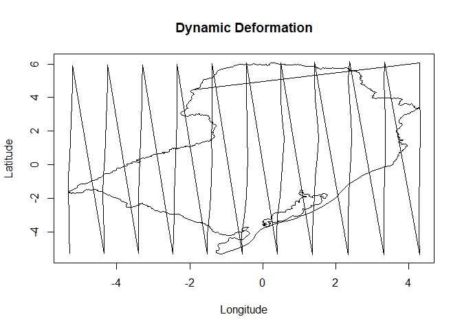

<!-- README.md is generated from README.Rmd. Please edit that file -->

# Stdyndef

<!-- badges: start -->
<!-- badges: end -->

# Stdyndef: Spatiotemporal Modeling with Dynamic Deformation for Nonstationary Covariance Structures

The `Stdyndef` package implements a novel spatiotemporal modeling
framework with dynamic deformation, allowing for nonstationary
covariance structures. This innovative approach is ideal for analyzing
spatiotemporal data with evolving spatial relationships, such as monthly
average temperature data.

## Installation

You can install the development version of Stdyndef from
[GitHub](https://github.com/Projeto-CNPq-Clima/Stdyndef) with:

``` r
# install.packages("pak")
pak::pak("Projeto-CNPq-Clima/Stdyndef")
```

## Example

This is a basic example which shows you how to solve a common problem:

``` r
library(Stdyndef)
## basic example code
# Load sample data
data(temperature)
data(FT)
data(MatFFT)
data(GT)
data(sites)
data(GAMA)
data(Map)

# Fit the model
Mod <- SpatialDeformationMCMC(
  response = temperature,
  FT = FT,
  MatFFT = MatFFT,
  GT = GT,
  sites = sites,
  GAMA = GAMA,
  iteration = 100,
  burnin = 50,
  jump = 2
)
#> [1] 1
#> [1] 2
#> [1] 3
#> [1] 4
#> [1] 5
#> [1] 6
#> [1] 7
#> [1] 8
#> [1] 9
#> [1] 10
#> [1] 11
#> [1] 12
#> [1] 13
#> [1] 14
#> [1] 15
#> [1] 16
#> [1] 17
#> [1] 18
#> [1] 19
#> [1] 20
#> [1] 21
#> [1] 22
#> [1] 23
#> [1] 24
#> [1] 25
#> [1] 26
#> [1] 27
#> [1] 28
#> [1] 29
#> [1] 30
#> [1] 31
#> [1] 32
#> [1] 33
#> [1] 34
#> [1] 35
#> [1] 36
#> [1] 37
#> [1] 38
#> [1] 39
#> [1] 40
#> [1] 41
#> [1] 42
#> [1] 43
#> [1] 44
#> [1] 45
#> [1] 46
#> [1] 47
#> [1] 48
#> [1] 49
#> [1] 50
#> [1] 51
#> [1] 52
#> [1] 53
#> [1] 54
#> [1] 55
#> [1] 56
#> [1] 57
#> [1] 58
#> [1] 59
#> [1] 60
#> [1] 61
#> [1] 62
#> [1] 63
#> [1] 64
#> [1] 65
#> [1] 66
#> [1] 67
#> [1] 68
#> [1] 69
#> [1] 70
#> [1] 71
#> [1] 72
#> [1] 73
#> [1] 74
#> [1] 75
#> [1] 76
#> [1] 77
#> [1] 78
#> [1] 79
#> [1] 80
#> [1] 81
#> [1] 82
#> [1] 83
#> [1] 84
#> [1] 85
#> [1] 86
#> [1] 87
#> [1] 88
#> [1] 89
#> [1] 90
#> [1] 91
#> [1] 92
#> [1] 93
#> [1] 94
#> [1] 95
#> [1] 96
#> [1] 97
#> [1] 98
#> [1] 99
#> [1] 100

# Compute deformations on a 10x10 grid
Mmd <- compute_Mmd(Mod, temperature, sites, Map, dd = 10)

# Plot results for the first deformation
x <- Mmd[1:(nrow(Mmd) / 2), 1]
y <- Mmd[(nrow(Mmd) / 2 + 1):nrow(Mmd), 1]
plot(x, y, type = "l", main = "Dynamic Deformation", xlab = "Longitude", ylab = "Latitude")
```



``` r

# Calculate DIC
dic_results <- DIC(
  MCMC_output = Mod,
  response = temperature,
  FT = FT,
  MatFFT = MatFFT,
  GT = GT,
  sites = sites,
  GAMA = GAMA
)

# View results
print(dic_results)
#> $DIC
#> [1] 9735.573
#> 
#> $pD
#> [1] 611.282
#> 
#> $DDpost
#> [1] 8513.009


?SpatialDeformationMCMC
#> inicializando servidor httpd de ajuda ... concluído
?compute_Mmd
?DIC
```
